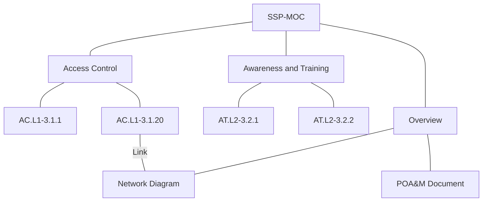

# Plan Text System Security Plan

A markdown based system security plan

## Obsidian Setup

The primary goal here was to keep the plugin dependencies as minimal as possible. So, I used the built-in plugins as much as possible and installed two community plugins (listed below) to help make this vault feel more like an application with a searchable database backend.

## Community Plugins

- Advanced Tables
- Dataview

## Other Obsidian Configuration Settings

These are the settings that I changed from the default setting.

| Setting                                     | Status                | Reason                                    |
| ------------------------------------------- | --------------------- | ----------------------------------------- |
| Editor -> Display -> Readable Line Length   | Disabled              | Preference                                |
| Editor -> Display -> Show Frontmatter       | Enabled               | Reasons noted in YAML Frontmatter section |
| Editor -> Behavior -> Spell Check           | Enabled               | Usability                                 |
| Files & Links -> New Link Format            | Relative Path to File | Exportability?                            |
| Files & Links -> Use Wikilinks              | Disabled              | Future proofing                           |
| Appearance -> Advanced -> Show Inline Title | Disabled              | Because I can't stand it                  |

## YAML Frontmatter

A lot of the functionality for this vault comes in properly using the YAML frontmatter for pertinent information on any specific control that you would like to be able to query using Dataview. These are things like continuous monitoring frequency, responsible parties, implementation status, etc. Normally this frontmatter is hidden by default, but it is still information that I would like to be able to see no matter which view I am using.

## File Structure

The structure of this vault is intended to be very flat with the primary method of organization being Maps of Content (MOC). To give an illustration, the primary MOC, or "landing page" if you will, is the SSP-MOC. This file links directly to each control. The control families link to files for each individual control, and those controls link to artifact documentation.

An example below shows how the basic file structure is shown, but control AC.L1-3.1.20 has a link to the Network Diagram as one of its artifacts.

## What About SSP Approvals?

This is where the feasibility of this project rests on the organization. The idea of using this as documentation is to actually float this through the Configuration Change Board (CCB) using a code review tool + ticketing system; I'm more partial to GitLab for this, but other tools could be utilized. This approach would track all changes to the SSP with a proper approval chain in the ticketing system. Future tooling will be implemented to utilize Pandoc to print this vault to a single coherent document with signature fields for approving parties.